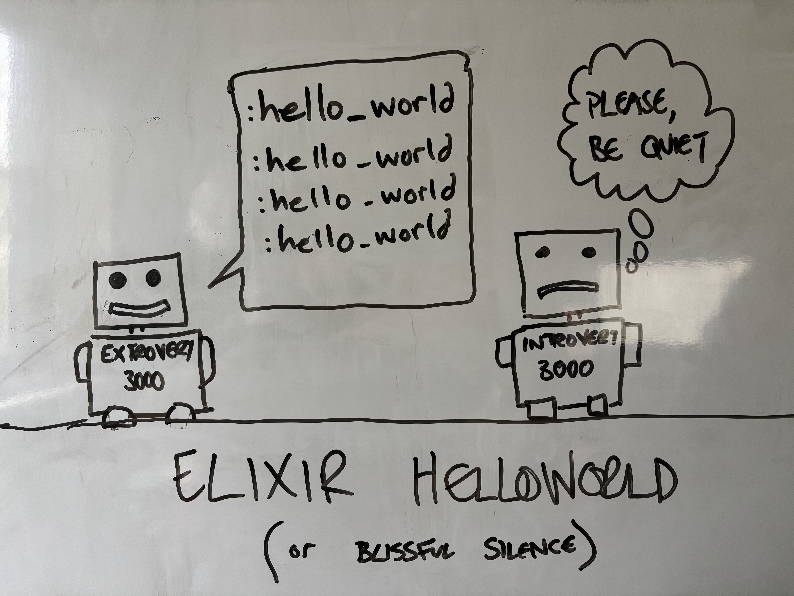

### Elixir Hello, World!

Truth be told, there's not really a lot you can do with this example and in a lot of ways it's not really a HelloWorld example.

The idea here was to showcase

- OTP `GenServers` talking to each other
- OTP `Supervisors` running a bunch of servers
- Use ExUnit for unit tests and doc tests
- Use Elixir to handle some input from a 3rd party file (CSV)
- Use ExDoc to publish documentation for the package
- Use GitHub actions to demonstrate CI/CD usage in Elixir land
- Use Cloudflare pages to host the documentation

Obviously, this is a slightly excessive version of "Hello, world!".  If you want to know more about the rationale behind over the top examples of "Hello, world!" then go [read the readme][0]

[0]: https://github.com/treejamie/helloworld